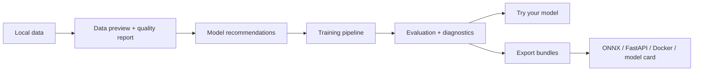

<div align="center">


# NoCode Deep Learning Studio

**A local-first desktop studio for training, evaluating, and exporting deep learning models without writing code.**

[](https://github.com/BenAmpel/NoCode-Deep-Learning/actions/workflows/test-windows-installer.yml)
[](https://github.com/BenAmpel/NoCode-Deep-Learning/releases/latest)
[](https://github.com/BenAmpel/NoCode-Deep-Learning/stargazers)
[](LICENSE)
[](https://www.python.org/)
[](https://pytorch.org/)
[](https://buymeacoffee.com/bampel)

[Download](https://github.com/BenAmpel/NoCode-Deep-Learning/releases/latest) · [Quickstart](#quickstart) · [Documentation](docs/index.md) · [Contributing](CONTRIBUTING.md)


</div>

---

## Why This Project Exists

Most machine learning tools either assume you can code, or hide the modeling process so deeply that it becomes hard to learn from. **NoCode Deep Learning Studio** is designed to sit in the middle: it gives you a visual workflow for serious local model development, while still exposing the concepts that matter.

It runs entirely on your own machine and walks through the full workflow:

```text
Data → Model → Train → Evaluate → Dashboard → Try Your Model → Export
```

That means you can move from raw files to a trained model, inspect the results, compare runs, and export a local deployment bundle without leaving the app.

## What Makes It Different

- Local-first: data never leaves the machine unless you choose to export it.
- Multi-modal: image, tabular, text, audio, time-series, and video workflows in one interface.
- Guided: recommendations, quality checks, and “why this matters” hints are built into the workflow.
- Practical: exports include ONNX bundles and generated deployment scaffolds.
- Teachable: the interface is designed to make modeling decisions visible rather than hidden.

## Quickstart

### 1. Install

Download the latest installer from the [Releases page](https://github.com/BenAmpel/NoCode-Deep-Learning/releases/latest).

| Platform | Package | Notes |
|---|---|---|
| macOS | `NoCode-DL-x.x.x.pkg` | Signed and notarized |
| Windows | `NoCode-DL-Setup-x.x.x.exe` | Built and tested in native Windows CI |

On first launch, the app downloads Python 3.12 and installs its runtime dependencies.

### 2. Launch the built-in tutorial

Open the app and use the built-in `Load MNIST Tutorial` workflow to try the full experience with a prepared dataset.

### 3. Train a baseline model

Preview the data, accept or override the recommended settings, and run a short baseline training pass.

### 4. Review and export

Inspect metrics and visual diagnostics, then export the trained model as ONNX or a generated app/server bundle.

## Feature Overview

| Area | Highlights |
|---|---|
| Data | Schema inference, feature selection, quality reports, random subsets for quick experiments |
| Modeling | 40+ architectures across multiple modalities, guided defaults, multi-model sweeps |
| Training | Live telemetry, ETA, logs, cross-validation, significance testing |
| Evaluation | Confusion matrices, ROC curves, explainability views, diagnostics by task |
| Inference | Single-file prediction, batch prediction, saved preprocessing reuse |
| Export | ONNX bundles, FastAPI generation, Docker scaffolds, model cards |

## Supported Modalities

| Modality | Example Tasks | Example Models | Built-in Tutorial |
|---|---|---|---|
| Image | Classification, object detection | ResNet, ViT, MobileNetV3, YOLOv8 | MNIST digits |
| Tabular | Classification, regression | XGBoost, RandomForest, MLP | Iris species |
| Text | Classification, sentiment | BERT, DistilBERT, TF-IDF + LR | 20 Newsgroups subset |
| Audio | Classification | CNN-spectrogram, Whisper features | Spoken digits |
| Time Series | Classification, forecasting | LSTM, GRU, CNN1D, TCN | Synthetic signals |
| Video | Classification | 3D CNN, SlowFast-style baselines | Synthetic shape clips |

## Product Tour

<div align="center">
<table>
<tr>
<td align="center"><br/><sub>Data tab: schema detection, feature mapping, quality reporting</sub></td>
<td align="center"><br/><sub>Train tab: live telemetry, ETA, logs, and training curves</sub></td>
</tr>
<tr>
<td align="center"><br/><sub>Evaluate tab: metrics, explainability, and diagnostics</sub></td>
<td align="center"><br/><sub>Export tab: deployment bundles and sharing artifacts</sub></td>
</tr>
</table>
</div>

## Architecture at a Glance



## Installation for Developers

```bash
git clone https://github.com/BenAmpel/NoCode-Deep-Learning.git
cd NoCode-Deep-Learning
python3 install.py
python3 run_local.py
```

Requirements:
- Python 3.12
- macOS 12+ or Windows 10+
- Optional GPU support through MPS or CUDA

More detail:
- [Developer setup](SETUP.md)
- [Documentation index](docs/index.md)
- [Release checklist](RELEASE_CHECKLIST.md)

## Documentation

- [Overview](docs/index.md)
- [Installation](docs/installation.md)
- [Quickstart and tutorials](docs/tutorials.md)
- [Architecture and packaging](docs/architecture.md)
- [Contributing guide](CONTRIBUTING.md)

## Building Installers

### macOS

```bash
python3 packaging/build_macos_installer.py --version 1.0.0
python3 packaging/sign_and_notarize_macos.py \
  --version 1.0.0 \
  --app-sign-identity "Developer ID Application: Your Name (TEAMID)" \
  --installer-sign-identity "Developer ID Installer: Your Name (TEAMID)" \
  --keychain-profile AC_PASSWORD
```

### Windows

```powershell
python packaging/build_windows_installer.py --version 1.0.0
```

The Windows build expects Inno Setup 6 (`iscc.exe`) to be installed and available on `PATH`.

## Repository Standards

This repository includes:
- [Contributing guidelines](CONTRIBUTING.md)
- [Code of conduct](.github/CODE_OF_CONDUCT.md)
- [Security policy](.github/SECURITY.md)
- Issue templates and a pull request template under `.github/`

## Academic Context

This project is also being written up for academic dissemination. Manuscript drafts and venue-specific materials live alongside the software source in this repository.

## License

[MIT](LICENSE) © Dr. Benjamin M. Ampel, Georgia State University

<div align="center">

Built with [PyTorch](https://pytorch.org/) · [Gradio](https://gradio.app/) · [scikit-learn](https://scikit-learn.org/) · [ONNX Runtime](https://onnxruntime.ai/)

Runs on your machine. Your data stays with you.

---

If this project saves you time, consider buying me a coffee ☕

<a href="https://buymeacoffee.com/bampel">
  
</a>

</div>
